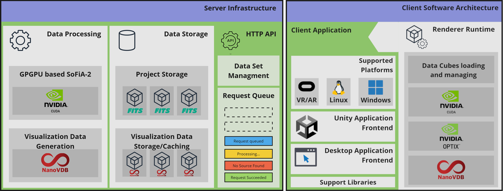

## B3D Visualization Project
B3D-vis is a research project developed by the Institute of Visual Computing at the University of Applied Sciences Bonn-Rhein-Sieg, based on the B3D initiative.

## Why b3d-vis?
This project was created as a proof of concept in different visualization scenarios as part of the research on the visualization of astronomical data.
The project is focused on covering two research scenarios. The first is to visualize HI-Datacube and perform a source search in noisy, unfiltered data. The Use case should demonstrate the iterative approach to source searching. For the source search, the project relies on the SoFiA2 algorithm. The desktop viewer was developed to cover that use case. The second scenario is the collaborative HI-Datacube investigation in the virtual environment, where multiple users/researchers can interact with different datasets.

Both use cases rely on the common Hi-Datacube renderer component based on the NanoVDB data structure. The original HI-datacubes data is stored in FITS file format, which is also used for input into the SoFiA2 algorithm. One of the components was created to implement the data-processing pipeline.

### Components Overview
The following diagram visualize the software architectural overview:



## Work in progress showcase
This showcase demo tease the source search workflow on a desktop viewer application.
<video src="./doc/b3d_vis_desktop_viewer_demo_09_2024.mp4" width="100%" controls></video>

# Quick start

Make sure `Optix7`, `TBB`, `CUDA` are installed on your system and the following paths are set:

- OPTIX_PATH
- TBB_PATH
- VCPKG_ROOT

`vcpkg`packet manager is required.


# Build instruction

## Prerequisites
Also make sure CMake Version 3.26 is installed.
The project uses CMake presets, so depending on the system an correct preset must be chosen.

For installing the [vcpkg](https://github.com/microsoft/vcpkg) packet manager, clone the repository and navigate to vcpkg folder:
```
git clone https://github.com/microsoft/vcpkg.git
cd vcpkg
```
Than execute `.\bootstrap-vcpkg.bat` on Windows or `.\bootstrap-vcpkg.sh` on Linux.

## Build server application

```
cmake --preset "x64-release"
```

## Build desktop viewer

Make sure that CUDA and OptiX libraries are installed on your system correctly.
For building the following variables must be set OPTIC_PATH and CUDA_PATH


### Windows


### Linux

## Build Unity Extension

## Build Unity VR Application

# License
For this project, the license, as found in the new repository, applies.
